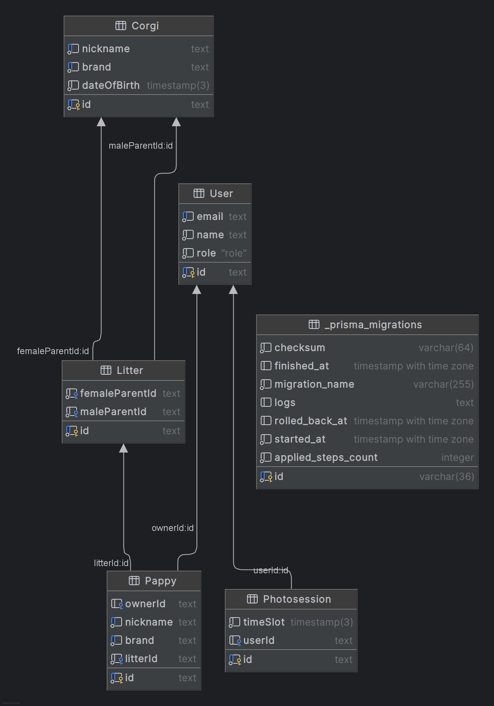

# Сайт питомника вельш-корги пемброк

## Что в нем есть?

* Галерея пометов
* Галерея питомцов
* Свободные и готовые к продаже щенки
* Запись на фотосесию с корги

## Схема базы данных

## Описание доменной модели 

* Litter - помет - щенки рожденные в один день и от одних родителей
* User - пользователь сайта (может быть админом)
* Photosession - набор временных выделенных на фотосессию с корги 
* Corgi - корги питомника, являются родителям щенков, по ним можно провести родословную
* Puppy - таблица щенков, которые были в продаже или находятся в продаже